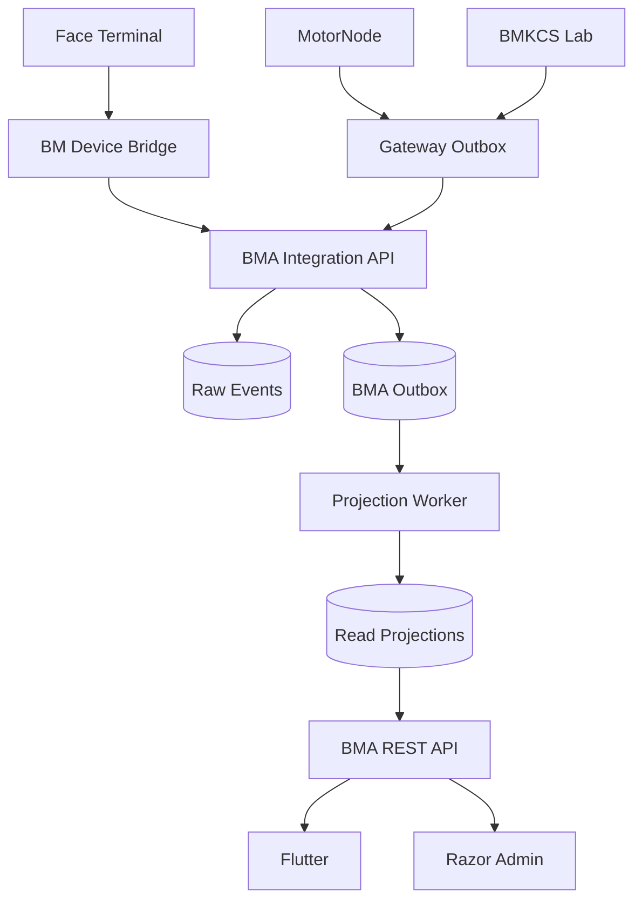

# Kiến trúc BMA

## Mục tiêu

BMA dùng một modular monolith để giảm chi phí vận hành và số điểm có thể lỗi,
nhưng vẫn tách ranh giới module bằng namespace, contract và ownership dữ liệu.

## Luồng dữ liệu

Raw event là bất biến. Mobile và Admin chỉ đọc projection hoặc tạo event điều
chỉnh; không update trực tiếp lịch sử gốc.

## Runtime MinhComp

- PostgreSQL 17 chạy native Windows.
- Production dùng database `binhminh_data`.
- Staging dùng database `binhminh_data_staging`.
- BMA Core chạy bằng `BMA-Production` hoặc `BMA-Staging` Windows Service.
- Service chỉ bind loopback; Cloudflare Tunnel cung cấp HTTPS public.
- Docker không thuộc runtime MinhComp.

## Module boundaries

| Module | Trách nhiệm |
| --- | --- |
| Authentication | Đăng ký, admin duyệt, access/refresh token, revoke session |
| Operations | Motor state, trạng thái nhà máy, runtime và lịch chạy |
| Quality | BMKCS published result, freshness, threshold và history |
| Recovery | Input/output mass cùng kỳ và công thức có version |
| Attendance | Phân luồng scan theo người/ca, ghép session, anomaly, adjustment, payroll approval |
| People | Hồ sơ, vai trò hệ thống và chức danh/trách nhiệm có hiệu lực |
| Announcements | Đối tượng nhận, inbox, read state và push registration |
| Integration | Canonical ingest, idempotency, outbox và reconciliation cursor |
| Audit | Actor, action, subject, before/after và correlation ID |

## Trạng thái nhà máy

| Input | Output | Heartbeat | Projection |
| --- | --- | --- | --- |
| ON | OFF | Fresh | `STARTING` |
| ON | ON | Fresh | `RUNNING` |
| OFF | ON | Fresh | `DRAINING` |
| OFF | OFF | Fresh | `STOPPED` |
| Bất kỳ | Bất kỳ | Stale/missing | `UNKNOWN` |

`INPUT OFF` không tự kết luận nhà máy dừng. `OUTPUT OFF` chỉ đóng ca sau
grace/debounce được cấu hình và khi Input đã OFF.

## Availability và bandwidth

- Mobile dùng ETag + cache local cho GET; lỗi mạng trả cache kèm cờ `isStale`.
- API dùng JSON compact và gzip/Brotli; không gửi chart image.
- Push chỉ mang event ID/deep link ngắn; app lấy chi tiết khi mở.
- Không polling dashboard HTML. Reconciliation có cursor và bị giới hạn batch.
- Không Redis/Kafka/Kubernetes trong baseline.

## Security baseline

- TLS ở Cloudflare; BMA Core chỉ được public qua Tunnel.
- Mật khẩu hash bằng ASP.NET Core `PasswordHasher`.
- Access token ngắn; opaque refresh token dài hạn được hash, rotate và có thể revoke.
- Integration key chỉ nằm trong secret store/environment.
- Event có payload hash; signature có thể bật khi thiết bị Entry/Exit hỗ trợ.
- Admin dùng secure cookie, antiforgery và role policy.
- Audit log không được update/delete qua API thông thường.
